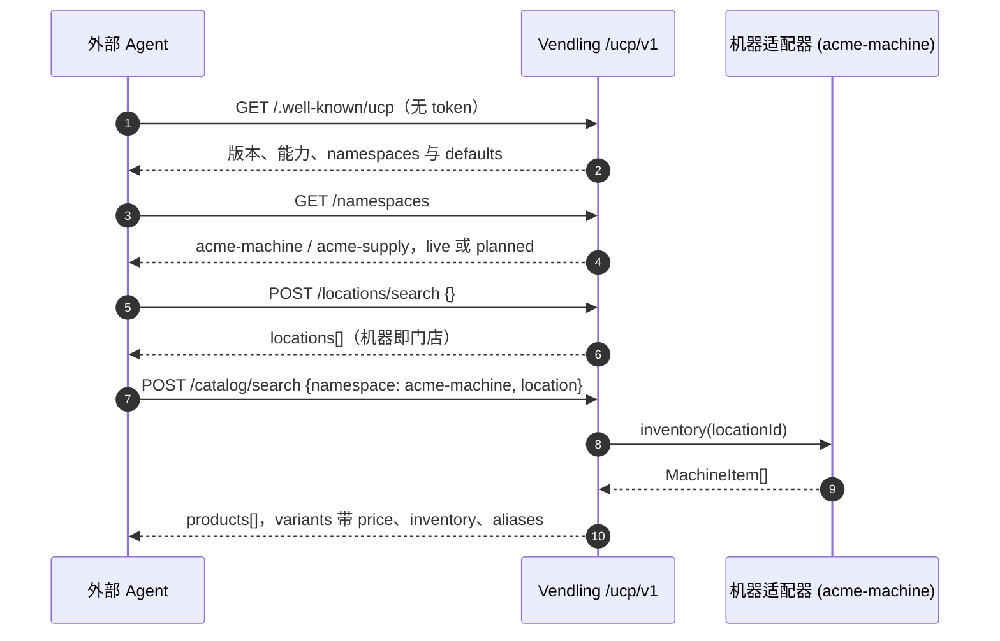
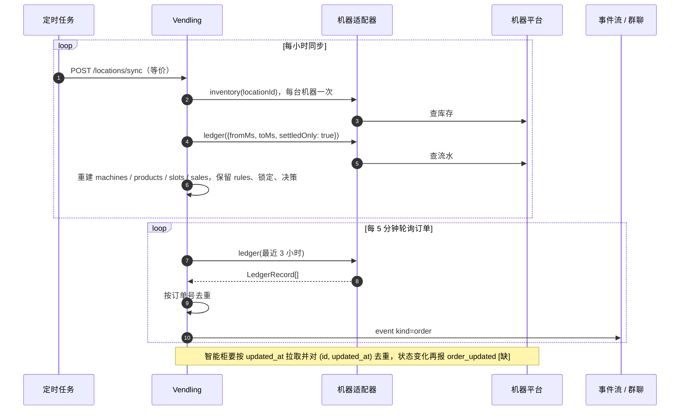
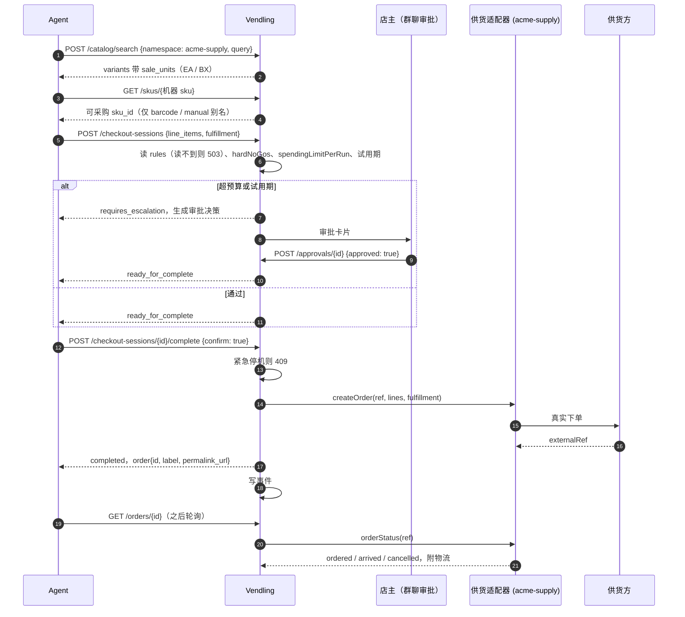
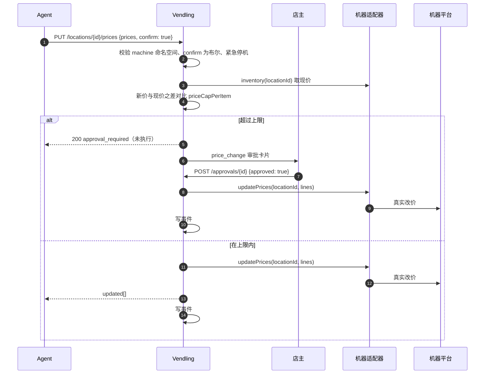
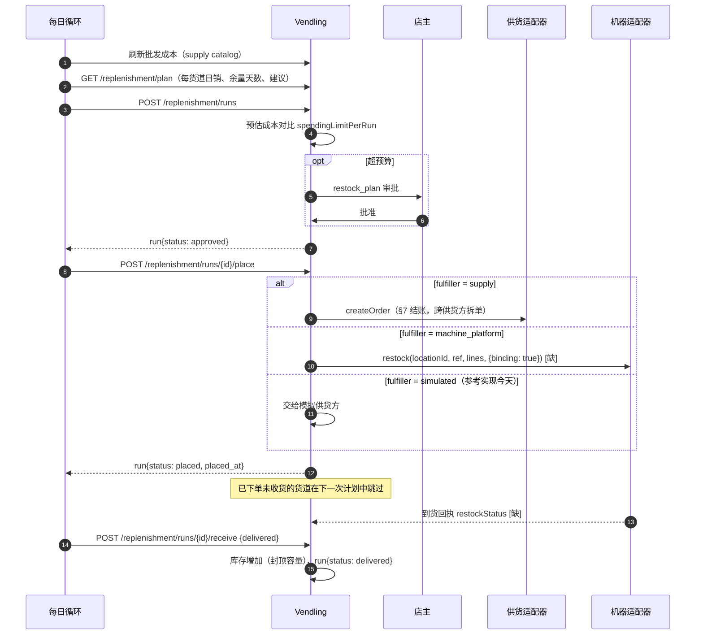
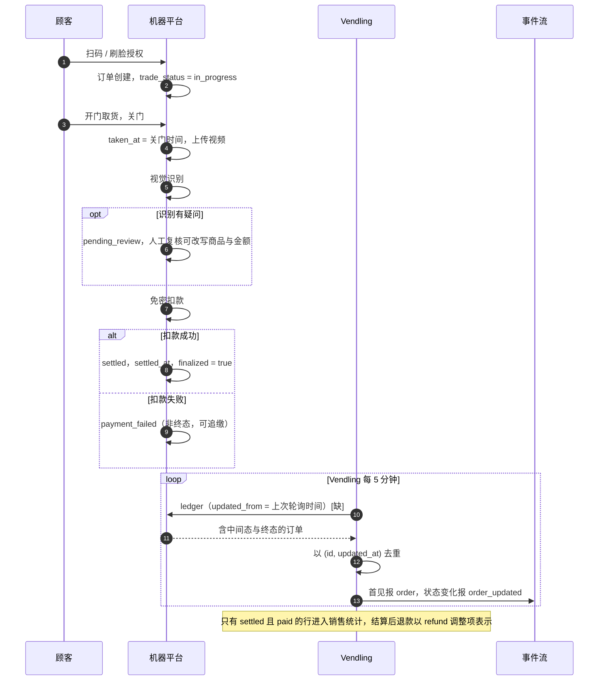

# Vendling Commerce API — 标准接口文档（UCP 对齐）

版本 `2026-09-10 v2` · 对齐 [Universal Commerce Protocol](https://ucp.dev) 稳定版 `2026-08-25`
· 机器可读版：[`openapi.yaml`](openapi.yaml) · [API Reference](reference) · [Agent Skill](skill/)

这份文档定义 Vendling（自主经营售货机线路的 AI 智能体）对外的商品类接口：供货方的 SKU 目录与采购下单、
机器平台的库存 / 交易流水 / 改价 / 补货推荐，以及本系统自己的补货计划、审批、事件。UCP 有对应概念的地方
（目录、结账、订单、门店位置、履约）沿用 UCP 的字段名与状态机；UCP 没有覆盖的售货机运营语义以 UCP 允许的
**扩展**方式定义，不改动标准部分。

**本文只讲协议，不讲任何具体厂商。** 机器平台与供货方通过**适配器**接入（附录 A），每个适配器登记一个
命名空间；调用方在运行时从 `GET /ucp/v1/namespaces` 拿到实际存在的命名空间。文中示例统一用占位厂商
`acme`：`acme-supply` 是供货方，`acme-machine` 是机器平台。

标记约定：**[有]** 已实现（`/ucp/v1/*`）；**[缺]** 规范已定义、尚未实现。

---

## 0. 索引

三张表：**端点**去哪一节找、**概念**以哪一节为准、**哪份文档**给谁看。章节目录在左侧边栏。

### 0.1 按端点

全部 32 个操作。★ 是 §2.1 的最小接入集。

| ★ | 端点 | 章节 | 是什么 |
|---|---|---|---|
| ★ | `GET /.well-known/ucp` | §4 | 发现档案：版本、能力、命名空间。公开，无需 token |
| ★ | `GET /namespaces` | §5.4 | 运行时有哪些命名空间、谁是缺省 |
| ★ | `POST /catalog/search` | §5.1 §5.2 | `supply` 命名空间 = 供货方在卖什么；`machine` = 某台机器里有什么 |
|  | `POST /catalog/lookup` | §5.3 | 按 `sku_id` 批量取，≤ 50 个，可跨命名空间；变体带 `aliases[]`，这就是批量解析 |
|  | `GET /skus/{sku_id}` | §5.4 | 一个 SKU 的身份、条码、别名、可采购来源 |
|  | `PUT /skus/{sku_id}/aliases` | §5.4 | 人工确认两个号是同一件货 |
| ★ | `POST /locations/search` | §6 | 有哪些机器；可按某商品此刻是否有货筛选 |
|  | `PUT /locations/{id}` | §6 | 注册 / 更新一台机器及其周边档案 |
|  | `DELETE /locations/{id}` | §6 | 移除一台机器（保留事件与对话） |
| ★ | `POST /locations/sync` | §6 | 立即把库存与流水拉进线路状态 |
|  | `GET /locations/{id}/inventory` | §5.2.1 | 实时直读货道，不经同步副本 |
| ★ | `PUT /locations/{id}/prices` | §9 | **改真实售价**；`confirm: true`，超上限转审批 |
|  | `POST /locations/{id}/restock` | §10.3 | 给机器平台的补货请求：`binding` 假 = 推荐，真 = 有约束力的订单 |
| ★ | `POST /checkout-sessions` | §7.1 | 开一张采购会话（此时还没花钱） |
|  | `GET /checkout-sessions/{id}` | §7.2 | 会话现状与待办 `messages[]` |
|  | `PUT /checkout-sessions/{id}` | §7.1 | 改行项目或履约方式 |
| ★ | `POST /checkout-sessions/{id}/complete` | §7.4 | **花真钱**：向供货方下单；`confirm: true` |
|  | `POST /checkout-sessions/{id}/cancel` | §7.3 | 撤销会话，不会调用供货方 |
| ★ | `GET /orders` | §8.2 | 机器交易流水（`kind=sale`）或采购单列表 |
|  | `GET /orders/{id}` | §8.1 | 一张采购单的供货方状态与物流，或一笔机器交易 |
| ★ | `GET /replenishment/plan` | §10.1 | 每个货道的日销、余量天数、建议动作 |
|  | `GET /replenishment/runs` | §10.2 | 按状态列出补货行程 |
|  | `POST /replenishment/runs` | §10.2 | 按当前计划生成一次行程（可能触发审批） |
|  | `GET /replenishment/runs/{id}` | §10.2 | 一次行程 |
|  | `POST /replenishment/runs/{id}/place` | §10.2 | 把行程交出去执行（按 `fulfiller` 路由） |
|  | `POST /replenishment/runs/{id}/receive` | §10.2 | 确认到货，库存上调 |
|  | `GET /replenishment/score` | §10 | 预测准确度回看 |
| ★ | `GET /approvals` | §11 | 待审批 / 已处理的决策 |
|  | `GET /approvals/{id}` | §11 | 一条决策 |
| ★ | `POST /approvals/{id}` | §11 | 批准或驳回；批准改价即执行 |
| ★ | `GET /events` | §12 | 事件流（最新在前），响应带 `websocket_url` |
|  | `POST /events` | §12 | 其他 Agent 写入事件；不去重 |

### 0.2 按概念（以这一节为准）

跨章节反复出现的约定，只有一处是规范，别处都是引用。要改就改这一处。

| 概念 | 规范出处 | 一句话 |
|---|---|---|
| 响应信封、`messages[]` | §3.1 | 业务结果用 HTTP 200 + `messages[]`，协议错误用状态码 |
| 鉴权、请求头、幂等 | §3.2 §3.3 | 一个 operator token；`UCP-Agent`；`Idempotency-Key` |
| 金额 | §3.4 | 整数分 + `CNY`，任何地方都不用元 |
| 时间 | §3.5 | 对外 RFC 3339 带 `+08:00`；适配器内部 epoch ms |
| `sku_id` 与命名空间 | §3.6 | `<vendor>-<role>:<vendor_sku>`，运行时发现 |
| 分页 | §3.7 | `cursor` + `has_next_page` |
| 错误码与 severity | §3.8 | 全量码表；程序只认 `code` |
| 能力名的三种写法 | §5.4 | 档案级、命名空间级、登记时的简写 |
| 售卖单位 EA / BX | §5.1 | `sale_units[]`；缺省按个下单 |
| 别名与可采购来源 | §5.4 | 只有 `barcode` / `manual` 能下单 |
| 订单六态与三个时间 | §8.2 | `taken_at` 测需求、`settled_at` 记营收、`updated_at` 轮询 |
| 护栏与 `confirm: true` | §13 | 哪些动作要确认、受停机约束、要审批 |
| 适配器契约 | 附录 A | 上游厂商要实现的方法与字段 |
| 零代码 HTTP 接入 | A.6 | 八个端点、登记格式 |

### 0.3 文档面

| 面 | 给谁 | 内容 |
|---|---|---|
| 本文（指南） | 所有人 | **规范正文**：能力、实体、状态机、护栏、适配器契约 |
| [`openapi.yaml`](openapi.yaml) · [API Reference](reference) | 写代码 / 生成客户端 | 每个操作的请求、响应、schema；核心与合作伙伴徽标 |
| [Agent Skill `vendling-commerce-api`](skill/) | 调用本接口的 Agent | ID 规则、安全规则、配方、Python 客户端 |
| [Agent Skill `vendling-vendor-adapter`](skills/vendling-vendor-adapter/) | 厂商 / 供应商的 Agent | 按 A.6 出接口：字段对照、自检脚本、参考实现 |
| [agent-setup/prompt.md](agent-setup/prompt.md) | 任何 Agent | 一句话完成接入 |
| [`llms.txt`](llms.txt) · [`llms-full.txt`](llms-full.txt) | 机器 | 索引与全文 |

---

## 1. 对齐原则

| 维度 | UCP 的做法 | 本规范的做法 |
|---|---|---|
| 能力命名 | 反向域名 `{authority}.{service}.{capability}`，如 `dev.ucp.shopping.checkout` | 标准能力原样用 `dev.ucp.*`；本项目扩展用 `com.xiaopingfeng.vendling.*` |
| 版本 | 日期版本 `YYYY-MM-DD`，schema 自描述 | `ucp.version` = `2026-08-25`；扩展版本 `2026-09-10`；破坏性变更换日期 |
| 发现 | 商家在 `/.well-known/ucp` 发布档案；平台在 `UCP-Agent` 头里给出自己的档案 URL | 同上，见 §4；命名空间注册表也在档案里 |
| 响应信封 | 每个响应带 `ucp: {version, status, capabilities}`；错误走 `messages[]` | 同上，见 §3.1 |
| 金额 | 整数、货币最小单位、显式 `currency` | 全部用**分**、`"currency": "CNY"`；上游的任何单位在适配器里统一 |
| 字段命名 | `snake_case`，JSON Schema 2020-12 | 同上 |
| 传输 | REST 为核心 | REST；MCP 绑定由 Agent skill 的工具对应 |
| 目录 → 结账 → 订单 | 目录返回的 `variants[].id` 直接作为结账的 `line_items[].item.id` | 同上，且这个 ID 在所有接口里都是同一个 `sku_id`（§3.6） |
| 履约 | `dev.ucp.shopping.fulfillment`：`methods[]` 的 `shipping` / `pickup` | 供货方配送或自提；自提时段做成可选的 `options[]` |
| 销售单位 | `quantity_unit`（sale basis），缺省 `each` | 同一 SKU 可按个（`EA`，缺省）或按箱（`BX`）下单，箱规在 `sale_units[]` 里公布 |
| 人工介入 | `status: requires_escalation` + `continue_url`，`severity: requires_buyer_review` | 花钱 / 改价的人工审批用这一套表达，审批本身是扩展 §11 |

UCP 明确允许的扩展点，本规范都只用这些：`metadata` 对象、自定义 `fulfillment.methods[].type`、开放的
`fulfillment.events[].type` / `adjustments[].type`、自由的 `messages[].code`、`actions` 映射、
以 `extends` 声明的扩展能力、能力条目上的 `config`。

---

## 2. 角色与方向

UCP 只定义两个角色：**Platform**（消费能力的一方）和 **Business**（暴露能力的一方）。Vendling 同时扮演两个角色：

```
                ┌──────────── 上游：Vendling 是 Platform ──────────────┐
                │                                                       │
   供货方 <vendor>-supply   ◄── catalog / checkout / order status ──  Vendling
   （Business：卖货给我们）      §5.1          §7          §8.1            │
                                                                       │
   机器平台 <vendor>-machine ◄── inventory / ledger / prices / recommend ┤
   （Business：运营机器）        §5.2      §8.2     §9       §10.3        │
                                                                       │
                ┌──────────── 下游：Vendling 是 Business ─────────────┤
                │                                                       │
   运营者 / 其他 Agent / 顾客界面  ────────────────────────────────────►│
   （Platform）    §6 位置  §5 目录  §8 订单  §10 补货  §11 审批  §12 事件
```

上游不必讲 UCP：每个厂商一个**适配器**（附录 A），把它翻译成本规范的形状。下游调用方只看本规范，
永远不会碰到厂商自己的字段。

### 2.1 最小接入集（核心 API）

**五步接入**（运营者或 Agent，拿到 token 之后）：

1. `GET /.well-known/ucp` —— 版本、能力、命名空间与缺省值（无需 token）；
2. `POST /locations/search {}` —— 有哪些机器；
3. `POST /catalog/search {"filters":{"namespace":"acme-machine","location":"…"}}` —— 机器里有什么、什么价；
4. `GET /orders?kind=sale&location=…&from=…&to=…` —— 卖了什么；
5. `GET /replenishment/plan` —— 该补什么。

其余接口按需再接。会花真钱、改真价的只有两个（§7 结账 `complete`、§9 改价），都要 `confirm: true`。
Agent 直接用 [一键接入](#agent-setup) 那句话，五步会自动跑完。

本规范一共 32 个操作，一条线路日常运转只依赖其中 13 个。它们要么是 Vendling 自己的定时循环每天在调的能力，
要么是仅有的两个会动真钱、改真价的动作。先接这些；其余的（批量 Lookup、别名注册表、结账会话的查改撤、采购单状态、
行程的列取下单收货、预测评分、补货请求、实时读货道……）按需再接。API Reference 里这 13 个操作带 **核心** 徽标。
关键场景的时序图见附录 C。

| ★ | 操作 | 能力 | 为什么必需 | Vendling 自己怎么用 |
|---|---|---|---|---|
| ★ | `GET /.well-known/ucp` | §4 发现 | 一切从这里开始：版本、能力、命名空间 | 外部 Agent 的入口 |
| ★ | `GET /namespaces` | §5.4 SKU 注册表 | 不知道命名空间就拼不出 `sku_id` | 同上 |
| ★ | `POST /locations/search` | §6 位置 | 有哪些机器 | 仪表盘的机器名册 |
| ★ | `POST /catalog/search` | §5.1 / §5.2 目录 | `machine` 命名空间 = 机器里有什么、什么价；`supply` 命名空间 = 供货方卖什么、什么价 | 每小时同步读库存；每天刷新一次批发成本 |
| ★ | `GET /orders?kind=sale` | §8.2 订单 | 交易流水，需求测算的唯一数据源 | 每小时同步 + 每 5 分钟轮询订单事件 |
| ★ | `POST /locations/sync` | §6 位置 | 把库存和流水拉进线路状态，补货计划以此为准 | 每小时定时任务、仪表盘"同步"按钮 |
| ★ | `GET /replenishment/plan` | §10.1 补货 | 每个货道的日销量、余量天数、建议动作 | 每天一次的 curate + restock 循环 |
| ★ | `POST /checkout-sessions` → `POST …/complete` | §7 结账 | 唯一会向供货方花真钱的路径 | 运营者或 Agent 触发；定时循环不会自己下单 |
| ★ | `PUT /locations/{id}/prices` | §9 定价 | 唯一会改机器真实售价的路径 | 运营者或 Agent 触发；超价格上限转审批 |
| ★ | `GET /approvals` · `POST /approvals/{id}` | §11 审批 | 人在回路：超预算、超价格上限的动作停在这里 | 群聊里的审批卡片、仪表盘 |
| ★ | `GET /events` | §12 事件 | 每个决定、每笔交易、每次报错的审计线 | 仪表盘实时流、每周给店主的信 |

不在表里但值得知道的两点：`POST /events` 是顾客界面写"想要什么"意图的通道，属于内部桥接而非接入必需；
`POST /replenishment/runs/{id}/place` 今天只把行程交给模拟供货方，真实采购走 §7。

### 2.2 合作伙伴视角：谁该看哪些接口

三类外部伙伴接触本规范的方式不同。**售货机厂商 / 机器管理平台**和**商品供应商 / 批发平台**站在上游：只需要让自己的
系统能被一个适配器（附录 A）翻译成规范的形状，不必自己讲 UCP。**运营者和 Agent 开发者**站在下游，直接调用标准接口。
页面顶部选"我是售货机厂商"或"我是商品供应商"会只保留各自相关的章节；API Reference 里对应操作带 **售货机厂商** /
**商品供应商** 徽标（★ = §2.1 的核心接口）。

| 接口 | 章节 | 售货机厂商 / 机器平台 | 商品供应商 / 批发平台 | 运营者 / Agent 开发者 |
|---|---|---|---|---|
| `GET /.well-known/ucp`、`GET /namespaces` | §4、§5.4 | 你的命名空间 `<vendor>-machine` 出现在这里 | 你的命名空间 `<vendor>-supply` 出现在这里 | ★ 入口 |
| `POST /catalog/search`（`machine` 命名空间） | §5.2 | ★ 数据来自你的 `inventory(locationId)` | | ★ 机器里有什么 |
| `GET /locations/{id}/inventory` | §5.2.1 | ★ 同一个 `inventory(locationId)`，但是实时直读，不经同步副本 | | ★ 机器**现在**有什么 |
| `POST /catalog/search`（`supply` 命名空间） | §5.1 | | ★ 数据来自你的 `catalog()`；按个 / 按箱两种售卖单位 | ★ 能买什么 |
| `POST /catalog/lookup` | §5.3 | 同上 | 同上 | 便利：一次最多 50 个 ID，变体带 `aliases[]` |
| `GET /skus/{id}`、`PUT …/aliases` | §5.4 | 条码是机器 SKU 与供货 SKU 之间的桥，`MachineItem.barcode` 请给全 | 目录里给出条码，别名就能自动对上 | 便利 |
| `POST /locations/search`、`PUT /locations/{id}` | §6 | `locationId` 就是你的机器编号 | | ★ 有哪些机器 |
| `POST /locations/sync` | §6 | ★ 每小时调用你的 `inventory` + `ledger` | | ★ 刷新线路状态 |
| `POST /checkout-sessions` → `POST …/complete` | §7 | | ★ 变成你的 `createOrder(ref, lines, fulfillment)`：快递或自提 | ★ 花真钱 |
| `GET /orders/{id}`（`kind: purchase`） | §8.1 | | 变成你的 `orderStatus(ref)`，含物流 | 便利 |
| `GET /orders?kind=sale` | §8.2 | ★ 数据来自你的 `ledger()`，账户级交易流水 | | ★ 需求信号 |
| `PUT /locations/{id}/prices` | §9 | ★ 变成你的 `updatePrices()`，真实改价 | | ★ 改真价 |
| `POST /locations/{id}/restock`（`binding` 假 / 真） | §10.3 | 变成你的 `restock()`：假 = 给运维的推荐，真 = 你执行并回执的**补货订单** | | 便利 / ★ 补货执行 |
| `GET /replenishment/plan`、`/replenishment/runs…` | §10.1–10.2 | | | ★ 计划；行程 |
| `GET /approvals`、`POST /approvals/{id}` | §11 | | | ★ 人在回路 |
| `GET /events`、`POST /events` | §12 | | | ★ 审计线 |

**售货机厂商 / 机器管理平台要做的**：实现附录 A.3 的 `inventory` 与 `ledger`，按你支持的能力再加 `updatePrices`、`restock` + `restockStatus`，
登记命名空间 `<vendor>-machine`（A.4）。不想写代码就按附录 A.6 把这几个方法暴露成 HTTPS 接口，把地址和 token 交给运营者登记即可。不需要理解结账、采购单、补货计划——那些在你之上。

**商品供应商 / 批发平台要做的**：实现附录 A.2 的三个方法（`catalog`、`createOrder`、`orderStatus`），登记 `<vendor>-supply`；同样可以走 A.6 的 HTTPS 形式。
目录请带条码和箱规（`packSize`），只按个卖就给 `packSize = 1`；`createOrder` 以采购单号 `ref` 幂等。不需要理解机器库存、改价、审批。

**运营者 / Agent 开发者要做的**：从 §2.1 的最小接入集开始，用 `/.well-known/ucp` 发现命名空间，然后读 Agent Skill 或 OpenAPI。

### 2.3 接入流程

三条线，每条都以一次可验证的调用收尾；没有申请单、没有联调会议。

| | 运营者 / Agent | 售货机厂商 / 机器平台 | 商品供应商 / 批发平台 |
|---|---|---|---|
| 1 | 向运营者要一个 token | 按 A.6 暴露 `inventory`、`ledger` 两个 GET（可选：`prices`、`restock`）；让你的 Agent 用 [vendling-vendor-adapter](skills/vendling-vendor-adapter/) skill 做字段对照和自检 | 按 A.6 暴露 `catalog`、`orders`、`orders/{ref}`；同样可用该 skill |
| 2 | `GET /.well-known/ucp`（或把 [一键接入](#agent-setup) 发给 Agent） | 把 base URL 和 token 交给运营者 | 把 base URL 和 token 交给运营者 |
| 3 | §2.1 的五步 | 运营者登记 `<vendor>-machine`，`GET /namespaces` 立即可见 | 运营者登记 `<vendor>-supply` |
| 4 | 需要花钱 / 改价时读 §13，带 `confirm: true` | `PUT /locations/{id}` 注册机器，`POST /locations/sync` 跑通即接入完成 | `POST /catalog/search` 看到自己的商品即接入完成 |
| 验证 | `GET /orders?kind=sale` 有流水 | 库存和流水出现在 §5.2 / §8.2 | 一张 §7 的结账会话走到 `ready_for_complete` |

厂商侧不必实现全部方法：不支持远程改价就不暴露 `prices`，登记时不声明 `pricing` 能力，调用方会看到 `namespace_unsupported` 而不是假成功。

---

## 3. 通用约定

### 3.1 响应信封

```json
{
  "ucp": {
    "version": "2026-08-25",
    "status": "success",
    "capabilities": {
      "dev.ucp.shopping.catalog.search": [{ "version": "2026-08-25" }],
      "com.xiaopingfeng.vendling.inventory": [{ "version": "2026-09-10" }]
    }
  },
  "products": [ ... ]
}
```

`ucp.capabilities` 列出本响应实际启用的能力（含扩展），调用方据此知道哪些扩展字段有效。

### 3.2 鉴权

| 场景 | 方式 | 说明 |
|---|---|---|
| 调用本规范的任何端点 | `Authorization: Bearer <VENDLING_AUTH_TOKEN>` | UCP 允许 API key。一把 token 全权，没有按调用方的 scope |
| 平台自我标识 | `UCP-Agent: profile="https://<platform>/.well-known/ucp"` | UCP 要求平台每个请求都带；当前记录、不校验 |
| 上游厂商 | 适配器内部处理（签名、密钥） | 凭证只在部署环境里；没有凭证的部署（staging）结构上无法花钱 |

发送一个有意义的 `User-Agent`。Cloudflare 会对默认的 `Python-urllib` UA 返回 403（错误 1010），那不是鉴权失败。

### 3.3 请求头

| 头 | 必需 | 说明 |
|---|---|---|
| `Content-Type: application/json` | 写操作 | |
| `UCP-Agent` | 平台请求 | 见 §3.2 |
| `Idempotency-Key` | 写操作应带 | 结账 / 采购单用 checkout `id` 兼作供货方的订单参考号，天然幂等；其余写操作 **[缺]** 尚未实现幂等存储 |

### 3.4 金额 `Price` / `Total`

```json
{ "amount": 550, "currency": "CNY" }
{ "type": "subtotal", "amount": 6600 }
```

- `amount` 恒为**整数、分**。`Total.amount` 是有符号的，退款等调整为负数。
- `totals[]` 类型用到 `subtotal`、`fulfillment`（配送费）、`total`。
- **成本**只在可靠时给出：适配器若发现上游报的"成本"与售价相同，视为未知（`null`），下游一律标"估算"，不冒充。

### 3.5 时间

对外一律 RFC 3339 带时区偏移，如 `"2026-09-09T14:03:00+08:00"`。上游厂商的时间格式与时区由适配器换算；
位置的营业时间按 UCP 用本地民用时间 + `timezone: "Asia/Shanghai"`。

### 3.6 SKU 标识与命名空间

一件商品在**所有**接口里只有一个标识：`sku_id`。

```
sku_id = "<namespace>:<vendor_sku>"
namespace = "<vendor>-<role>"      role ∈ supply | machine
```

- `vendor`：适配器登记的厂商标识（`[a-z][a-z0-9]*`）。`role`：`supply` 供货方，`machine` 机器平台。
- `vendor_sku`：厂商自己的编号，**原样保留、不解析**（不能含冒号和空白）。
- 整串是唯一身份，按精确字符串比较。不同命名空间的两个 `sku_id` 永远不相等，哪怕物理上是同一件货；跨命名空间的"同一件货"靠 §5.4 的**别名**表达。
- 实际存在哪些命名空间由运行时给出：`GET /ucp/v1/namespaces`（§5.4）或 `/.well-known/ucp` 里 `com.xiaopingfeng.vendling.sku` 能力的 `config.namespaces`。每条带 `vendor`、`role`、`status`（`live` / `planned`）、`capabilities`。

三条硬规则：

1. **适配器只认自己的命名空间。** 把 `acme-supply:…` 传给机器侧接口返回 `400 namespace_mismatch`。
2. **一张采购单只能有一个供货方命名空间。** 一张 PO 只发给一个供货方。
3. **包装不进 ID。** 整箱还是单个是下单时的计量单位（§7.1 `quantity_unit`）。缺省按个。

其余标识符：

| 对象 | 格式 |
|---|---|
| 位置（机器）`Location.id` | 机器平台的机器编号 |
| 货道 `slot_id` | `<location>-<vendor_sku>`（机器平台没有货道概念时的替身） |
| 采购结账 / 采购单 `Checkout.id` = `Order.id` | `po_<yyyymmdd>_<seq>` 或调用方给定的 PO 号；供货方回的订单号放在 `Order.label` |
| 机器交易 `Order.id` | 机器平台的交易流水号 |
| 补货行程 `ReplenishmentRun.id` | `run-<epoch ms>` |
| 决策 / 审批 `Approval.id` | `dec-<epoch ms>-<n>` |
| 事件 `Event.id` | `evt-<epoch ms>-<n>` |

### 3.7 分页

游标分页：请求 `pagination: {cursor, limit}`，响应 `pagination: {cursor, has_next_page, total_count}`。`limit` 缺省 20。

### 3.8 错误模型

**协议层错误**用 HTTP 状态码 + 信封；**业务结果**按 UCP 约定用 HTTP `200` + `messages[]`，实体照常返回，
调用方**必须**先看 `messages` 再用数据。

```json
{
  "ucp": { "version": "2026-08-25", "status": "error" },
  "messages": [
    { "type": "error", "code": "kill_switch_engaged", "severity": "requires_buyer_review", "path": "$",
      "content": "kill switch is engaged — real writes are frozen" }
  ],
  "continue_url": "https://vendling.xiaopingfeng.com/"
}
```

| `code` | severity | HTTP | 触发 |
|---|---|---|---|
| `missing` / `invalid` | recoverable | 400 | 必填缺失 / 类型范围不对，`path` 指向字段 |
| `not_found` | unrecoverable | 404 | |
| `unauthorized` | unrecoverable | 401 | token 错误；或上游拒绝凭证 |
| `out_of_stock` / `item_unavailable` | recoverable | 200 | UCP 标准 |
| `request_too_large` | recoverable | 400 | 批量超过 50 个 ID |
| `namespace_mismatch` | recoverable | 400 | 结账里混了多个供货方；或把别的命名空间的 ID 传给了只认自己的接口 |
| `namespace_unsupported` | unrecoverable | 400 | 命名空间已登记但没有 live 适配器 |
| `unresolved_sku` | recoverable | 200 | 机内 SKU 没有已确认的可采购别名 |
| `hard_no_go` | unrecoverable | 200 | 行项目命中 `rules.hardNoGos`；会话停在 `incomplete` |
| `approval_rejected` / `expired` | unrecoverable | 200 | 会话变为 `canceled` |
| `confirmation_required` | requires_buyer_review | 400 | 花钱 / 改价请求没带字面量 `confirm: true` |
| `approval_required` | requires_buyer_review | 200 | 护栏生成了待审批决策，`actions` 里给出 id |
| `kill_switch_engaged` | requires_buyer_review | 409 | 紧急停机开着 |
| `guard_unverifiable` | unrecoverable | 503 | 读不到护栏规则，**拒绝**执行 |
| `supplier_rejected` / `upstream_unreachable` | unrecoverable | 502 | 上游拒绝或不可达，`content` 带原文 |
| `already_placed` / `already_delivered` / `simulation_disabled` | unrecoverable | 409 | |

警告（`type: "warning"`，不阻塞）：`price_estimated`（单价由箱价换算）、`location_unverified`（机器号在流水里从未出现）、
`history_truncated`、`hours_unknown`、`same_namespace`、`sync_problem`。程序只认 `code`。

---

## 4. 发现档案 `/.well-known/ucp`

**[有]** 公开、无需 token。`endpoint` 指向标准基址 `https://vendling.xiaopingfeng.com/ucp/v1`。
节选（完整档案以线上为准）：

```json
{
  "ucp": {
    "version": "2026-08-25",
    "services": {
      "dev.ucp.shopping": [{ "version": "2026-08-25", "transport": "rest", "endpoint": "https://vendling.xiaopingfeng.com/ucp/v1", "spec": "…", "schema": "…" }]
    },
    "capabilities": {
      "dev.ucp.shopping.catalog.search": [{ "version": "2026-08-25", "spec": "…", "schema": "…" }],
      "dev.ucp.shopping.checkout":       [{ "version": "2026-08-25", "spec": "…", "schema": "…" }],
      "dev.ucp.shopping.fulfillment":    [{ "version": "2026-08-25", "extends": "dev.ucp.shopping.checkout" }],
      "dev.ucp.shopping.order":          [{ "version": "2026-08-25" }],
      "dev.ucp.common.location.search":  [{ "version": "2026-08-25" }],
      "com.xiaopingfeng.vendling.sku": [{
        "version": "2026-09-10",
        "extends": ["dev.ucp.shopping.catalog.search", "dev.ucp.shopping.catalog.lookup", "dev.ucp.shopping.checkout", "dev.ucp.shopping.order"],
        "config": {
          "namespaces": [
            { "namespace": "acme-supply",  "vendor": "acme", "role": "supply",  "status": "live", "capabilities": ["dev.ucp.shopping.catalog.search", "dev.ucp.shopping.checkout", "dev.ucp.shopping.order"] },
            { "namespace": "acme-machine", "vendor": "acme", "role": "machine", "status": "live", "capabilities": ["com.xiaopingfeng.vendling.inventory", "com.xiaopingfeng.vendling.pricing", "com.xiaopingfeng.vendling.replenishment"] }
          ],
          "defaults": { "machine": "acme-machine", "supply": "acme-supply" }
        }
      }],
      "com.xiaopingfeng.vendling.inventory":     [{ "version": "2026-09-10", "extends": ["dev.ucp.shopping.catalog.search", "dev.ucp.shopping.catalog.lookup"] }],
      "com.xiaopingfeng.vendling.location":      [{ "version": "2026-09-10", "extends": "dev.ucp.common.location.search" }],
      "com.xiaopingfeng.vendling.approval":      [{ "version": "2026-09-10", "extends": "dev.ucp.shopping.checkout" }],
      "com.xiaopingfeng.vendling.order":         [{ "version": "2026-09-10", "extends": "dev.ucp.shopping.order" }],
      "com.xiaopingfeng.vendling.pricing":       [{ "version": "2026-09-10" }],
      "com.xiaopingfeng.vendling.replenishment": [{ "version": "2026-09-10" }],
      "com.xiaopingfeng.vendling.events":        [{ "version": "2026-09-10" }]
    },
    "payment_handlers": {
      "com.xiaopingfeng.vendling.on_account": [{ "id": "supplier_account", "version": "2026-09-10" }]
    }
  },
  "keys": []
}
```

`payment_handlers` 只有一个：**账户挂账**。采购按供货方账户记账，下单不经过支付凭证，所以结账的
`payment.instruments[]` 只有 `type: "on_account"`，没有 `credential`。`keys` 为空：现在不做 RFC 9421 签名。

---

## 5. 目录 Catalog

能力：`dev.ucp.shopping.catalog.search`、`dev.ucp.shopping.catalog.lookup`
· 扩展：`com.xiaopingfeng.vendling.inventory`（机器库存视图）、`com.xiaopingfeng.vendling.sku`（销售单位、别名、SKU 注册表）

| 操作 | 方法 | 端点 | 说明 |
|---|---|---|---|
| Search Catalog | `POST` | `/catalog/search` | `filters.namespace` 选数据源；缺省是默认供货方 |
| Batch Lookup | `POST` | `/catalog/lookup` | 按 `sku_id` 批量取，最多 50 个，可跨命名空间 |
| 命名空间注册表（扩展） | `GET` | `/namespaces` | 运行时存在的命名空间与缺省值 |
| 取一个 SKU（扩展） | `GET` | `/skus/{sku_id}` | 见 §5.4 |
| 记别名（扩展） | `PUT` | `/skus/{sku_id}/aliases` | 见 §5.4 |

同一套端点，`filters.namespace` 的**角色**决定查哪种源：

| 角色 | 回答的问题 | 附加条件 |
|---|---|---|
| `supply` | 供货方能卖给我们什么：SKU 清单、箱规、箱价 / 单价、供货方库存 | — |
| `machine` | 某台机器现在有什么：机内商品、零售价、余量 | 必须给 `filters.location` |

### 5.1 供货方 SKU 清单（`<vendor>-supply`）
<!-- profiles: supply,vendor-supply -->

```http
POST /catalog/search
{ "query": "乌龙", "filters": { "namespace": "acme-supply", "categories": ["饮料"] }, "pagination": { "limit": 20 } }
```

一个供货方商品 = 一个 `Product` + 一个 `Variant`。**整箱 / 单个不是两个变体**，是同一个变体的两种销售单位
（`sale_units[]`），下单时用 `quantity_unit` 选。缺省单位是 `EA`（个）：按个下单是基础情况，按箱是可选项。

```json
{
  "ucp": { "version": "2026-08-25", "status": "success" },
  "products": [
    {
      "id": "acme-supply:10023",
      "title": "乌龙茶 500ml",
      "description": { "plain": "500ml*15瓶/箱" },
      "categories": [{ "value": "饮料", "taxonomy": "merchant" }],
      "price_range": { "min": { "amount": 380, "currency": "CNY" }, "max": { "amount": 380, "currency": "CNY" } },
      "variants": [
        {
          "id": "acme-supply:10023",
          "title": "乌龙茶 500ml",
          "price": { "amount": 380, "currency": "CNY" },
          "quantity_unit": { "unit": "EA", "display_text": "个", "increment": 1 },
          "sale_units": [
            { "unit": "EA", "display_text": "个", "increment": 1, "price": { "amount": 380, "currency": "CNY" }, "price_derived": true },
            { "unit": "BX", "display_text": "箱", "contains": 15, "increment": 1, "price": { "amount": 5700, "currency": "CNY" } }
          ],
          "unit_price": { "amount": 380, "currency": "CNY", "measure": { "value": 15, "unit": "EA" }, "reference": { "value": 1, "unit": "EA" } },
          "availability": { "available": true, "status": "in_stock" },
          "aliases": [],
          "metadata": { "vendor_sku": "10023", "spec": "500ml*15瓶/箱", "supplier_stock": 120 }
        }
      ],
      "metadata": { "sites": [{ "id": "site:2021", "address": "…" }] }
    }
  ],
  "pagination": { "has_next_page": false, "total_count": 1 }
}
```

`sale_units[]`（扩展）：

| 字段 | 说明 |
|---|---|
| `unit` | UN/ECE Rec 20 单位码：`EA` 个、`BX` 箱。与 UCP `quantity_unit.unit` 同一词表 |
| `contains` | 该单位含多少个 `EA`；`EA` 自身省略。适配器报 `packSize = 1` 时没有 `BX` |
| `increment` | 起订倍数，UCP 原字段 |
| `price` | 该单位一件的价格 |
| `price_derived` | 价格是换算出来的（适配器只拿到箱价时，单价 = 箱价 ÷ 箱规）。实际结算以供货方对账为准 |

`variants[].price` 恒为 **`EA` 单位的价格**，`quantity_unit` 恒为 `EA`：不认识 `sale_units` 的 UCP 标准客户端也能正确按个下单。
`metadata.sites[]` 是供货方的提货点（附录 A `SupplySite`），自提时用作目的地 ID。

### 5.2 机器库存（`<vendor>-machine`）— 扩展 `com.xiaopingfeng.vendling.inventory`
<!-- profiles: machine,vendor-machine -->

```http
POST /catalog/search
{ "filters": { "namespace": "acme-machine", "location": "12345678" } }
```

```json
{
  "products": [
    {
      "id": "acme-machine:8837",
      "title": "红牛 250ml",
      "price_range": { "min": { "amount": 600, "currency": "CNY" }, "max": { "amount": 600, "currency": "CNY" } },
      "variants": [
        {
          "id": "acme-machine:8837",
          "sku": "6920202888883",
          "barcodes": [{ "type": "EAN", "value": "6920202888883" }],
          "title": "红牛 250ml",
          "price": { "amount": 600, "currency": "CNY" },
          "availability": { "available": true, "status": "in_stock" },
          "inventory": { "location": "12345678", "slot_id": "12345678-8837", "stock": 7, "capacity": null, "locked": false },
          "aliases": [{ "sku_id": "acme-supply:10088", "source": "manual", "confirmed_at": "2026-09-01T10:00:00+08:00" }]
        }
      ]
    }
  ]
}
```

| 字段 | 位置 | 说明 |
|---|---|---|
| `filters.namespace` | 请求 | 一个 `machine` 角色的命名空间 |
| `filters.location` | 请求 | 机器 ID，必填 |
| `variants[].inventory.slot_id` | 响应 | `<location>-<vendor_sku>` |
| `variants[].inventory.capacity` | 响应 | 货道容量。只有运营者现场数过或从历史最高库存推出时才有值，否则 `null`，不默认 |
| `variants[].inventory.locked` | 响应 | 运营者锁定的货道，选品循环不得触碰 |
| `variants[].aliases[]` | 响应 | 其他命名空间里的同一件货，见 §5.4。这是从"机器缺货"走到"向谁采购"的唯一桥 |

**已知陷阱**：有的机器平台对**不存在的机器号也返回成功**。适配层用账户级交易流水做交叉检查：一个在同步窗口内
没有任何流水的机器号会在 `messages[]` 里得到 `type: "warning"`、`code: "location_unverified"`。

#### 5.2.1 直接读货道（实时）

上面那条 `POST /catalog/search` 答的是运营方**同步副本**里的机器状态，带别名、箱规、货道锁，
适合"缺货了该向谁采购"这类需要跨命名空间的问题。当你要问的只是最直白的那句
——"这台机器现在有什么、多少钱、还剩几个"——用这条：

```http
GET /locations/12345678/inventory
```

```json
{
  "ucp": { "version": "2026-08-25", "status": "success", "capabilities": { "com.xiaopingfeng.vendling.inventory": [{ "version": "2026-09-09" }] } },
  "location_id": "12345678",
  "read_at": "2026-09-10T17:42:11.000Z",
  "items": [
    { "sku_id": "acme-machine:8837", "vendor_sku": "8837", "title": "红牛 250ml",
      "barcodes": [{ "type": "EAN", "value": "6920202888883" }],
      "price": { "amount": 600, "currency": "CNY" }, "stock": 7 }
  ]
}
```

| 字段 | 说明 |
|---|---|
| `read_at` | 问平台的时刻。这条前面没有缓存 |
| `items[].price` | 此刻站在机器前的顾客要付的价 |
| `items[].stock` | 货道剩余。`0` 表示这条货道存在但卖空了；根本没上的货不会出现在列表里 |
| `items[].slot_id` | 机器里的位置。平台不报位置时这个字段不出现 |

**两者是不同的数据源，不是同一份数据的两种格式**：这条直接问机器，`/catalog/search` 答的是上一次同步。
两边对不上的时候，那个差本身就是信息——说明上次同步之后有东西卖掉了、卡货了，或者被补过货。

只读。不动钱、不改顾客看得见的东西，所以不需要 `confirm`，kill switch 也不管它。

### 5.3 Lookup
<!-- profiles: machine,supply -->

```http
POST /catalog/lookup
{ "ids": ["acme-supply:10023", "acme-machine:8837"], "filters": { "location": "12345678" } }
```

命名空间就在 ID 里，一次请求可以跨命名空间，按前缀分发（`machine` 角色的 ID 需要 `filters.location`）。
ID 去重；每个变体带 `inputs[]`（`exact` / `featured`）；超过 50 个 ID 返回 `400 request_too_large`。

### 5.4 命名空间与 SKU 注册表 — 扩展 `com.xiaopingfeng.vendling.sku`
<!-- profiles: supply,machine,adapter,vendor-machine,vendor-supply -->

```http
GET /namespaces
```

```json
{
  "namespaces": [
    { "namespace": "acme-supply",  "vendor": "acme", "role": "supply",  "status": "live",    "capabilities": ["…"] },
    { "namespace": "acme-machine", "vendor": "acme", "role": "machine", "status": "live",    "capabilities": ["…"] },
    { "namespace": "beta-supply",  "vendor": "beta", "role": "supply",  "status": "planned", "capabilities": [] }
  ],
  "defaults": { "machine": "acme-machine", "supply": "acme-supply" }
}
```

补货闭环要从"机器里 `acme-machine:8837` 快空了"走到"向 `acme-supply:10088` 采购"，这一步跨命名空间，靠别名：

| 操作 | 方法 | 端点 | 说明 |
|---|---|---|---|
| 取一个 SKU | `GET` | `/skus/{sku_id}?location=` | 身份、条码、别名、可采购来源 `purchasable_from[]`（含 `sale_units`） |
| 记别名 | `PUT` | `/skus/{sku_id}/aliases` `{aliases:[{sku_id, source?}]}` | 人工确认两个号是同一件货 |

批量解析不需要单独接口：`POST /catalog/lookup` 一次最多 50 个 ID，每个变体都带 `aliases[]`。

**能力名有三种写法**，指的是三件事，不要混：

| 写法 | 出现在 | 含义 |
|---|---|---|
| `com.xiaopingfeng.vendling.pricing` | `/.well-known/ucp` 的 `capabilities` | 本部署整体支持这个扩展 |
| `com.xiaopingfeng.vendling.replenishment.order` | `GET /namespaces` 里每个命名空间的 `capabilities[]` | **这一个**上游支持到哪一步 |
| `replenishment.order` | A.6 登记 JSON 的 `capabilities` | 登记时的简写，前缀自动补全 |

前两者的区别是「本系统会不会」与「这台机器的平台会不会」：档案里有 `pricing` 不代表每个 `machine` 命名空间都能改价。
调用前看命名空间自己的 `capabilities[]`，不支持的返回 `namespace_unsupported`。

别名规则：`source` ∈ `barcode`（两边都有 EAN 时自动建立）、`manual`（运营者确认）、`suggested`（按名称相似度提出）。
**只有 `barcode` 和 `manual` 参与下单**。别名是对称的。没有可采购来源不是错误，但带着这样的行去 §10.2 下单会得到 `unresolved_sku`。

---

## 6. 位置 Location
<!-- profiles: machine,vendor-machine -->

能力：`dev.ucp.common.location.search` · 扩展：`com.xiaopingfeng.vendling.location`

UCP 的 Location 是"地图上找得到的实体"。一台售货机正是：有地址、有营业时段、可以按"这里现在有没有某件商品"筛选。

| 操作 | 方法 | 端点 |
|---|---|---|
| Search Locations | `POST` | `/locations/search` `{query?, filters:{items?:[{id}], amenities?, hours?}}` |
| 注册 / 更新一台机器（扩展） | `PUT` | `/locations/{id}` `{name, profile?}` |
| 移除一台机器（扩展） | `DELETE` | `/locations/{id}` |
| 立即同步遥测（扩展） | `POST` | `/locations/sync` `{sales_window_days?}` |

```json
{
  "id": "12345678",
  "name": "某写字楼 11F",
  "address": { "street_address": "…", "extended_address": "11F 电梯厅", "address_locality": "北京市", "address_country": "CN" },
  "timezone": "Asia/Shanghai",
  "amenities": { "com.xiaopingfeng.vendling.qr_chat": { "description": "扫码可与机器对话、点单、报修" } },
  "online": true,
  "venue_name": "某写字楼11层",
  "venue_type": "office",
  "placement": "indoor",
  "profile_complete": true,
  "missing": []
}
```

- `hours[]` 未记录时**省略**：UCP 规定"缺 = 未知"而非"关门"；带 `filters.hours` 的搜索会附 `hours_unknown` 警告。
- `filters.items[]` 用 `machine` 角色的 `sku_id`，只返回该商品 `stock > 0` 的机器。按 UCP 语义这是临时性信号，不是保留。
- `PUT /locations/{id}` 注册后每小时自动同步；同步是整体替换机器 / 商品 / 货道 / 销售，但保留运营者的货道锁。`sales_window_days` 不得小于补货策略的观察期（21 天）。
- `DELETE` 清掉档案、周边信息、遥测；**保留**事件与对话历史。

---

## 7. 结账 Checkout
<!-- profiles: supply,vendor-supply -->

能力：`dev.ucp.shopping.checkout` + `dev.ucp.shopping.fulfillment` · 扩展：`com.xiaopingfeng.vendling.approval`、`com.xiaopingfeng.vendling.sku`

这是"**下单进货**"：向一个供货方下一张真实的、花真钱的采购单。UCP 的结账会话模型把它拆成
"建单 → 补齐信息 → 审批 → 提交"几步，每一步都有明确状态，钱只在最后一步动。

| 操作 | 方法 | 端点 |
|---|---|---|
| Create Checkout | `POST` | `/checkout-sessions` |
| Get Checkout | `GET` | `/checkout-sessions/{id}` |
| Update Checkout | `PUT` | `/checkout-sessions/{id}` |
| Complete Checkout | `POST` | `/checkout-sessions/{id}/complete` |
| Cancel Checkout | `POST` | `/checkout-sessions/{id}/cancel` |

### 7.1 建单

```http
POST /checkout-sessions
Idempotency-Key: po_20260909_001
{
  "id": "po_20260909_001",
  "line_items": [
    { "item": { "id": "acme-supply:10023" }, "quantity": 2, "quantity_unit": { "unit": "BX" } },
    { "item": { "id": "acme-supply:10088" }, "quantity": 6 }
  ],
  "fulfillment": {
    "methods": [{ "type": "shipping", "line_item_ids": ["*"],
      "destinations": [{ "type": "shipping_address", "street_address": "…", "address_locality": "北京市", "address_country": "CN", "first_name": "张三", "phone_number": "13800000000" }] }]
  }
}
```

- `id` 可选。给了就用作 PO 号（兼作供货方的订单参考号），没给由服务端生成。
- `line_items[].item.id` 必须来自 **`supply` 角色**的命名空间。`machine` 角色的 ID 不能直接下单，先经 §5.4 `resolve`。
- **一张单一个命名空间**：所有行的前缀必须相同，否则 `400 namespace_mismatch`。会话的 `vendor` 由第一行决定，建单后不可变。
- **按个下单是缺省**：`quantity_unit` 省略即 `{ "unit": "EA" }`。要按箱写 `{ "unit": "BX" }`，`quantity` 是箱数。`unit` 必须在该变体的 `sale_units[]` 里，否则 `400 invalid`。
- 履约二选一：
  - `shipping`：目的地必须有 `street_address` + `first_name`（联系人）+ `phone_number`，缺一建单时返回 `missing`。
  - `pickup`：目的地由服务端从供货方的提货点枚举（`site:<id>`），平台用 `selected_destination_id` 选点、`groups[].selected_option_id` 选自提时段（服务端生成未来 7 天的时段选项）。

### 7.2 会话实体

```json
{
  "ucp": { "version": "2026-08-25", "status": "success",
           "payment_handlers": { "com.xiaopingfeng.vendling.on_account": [{ "id": "supplier_account", "version": "2026-09-10" }] } },
  "id": "po_20260909_001",
  "status": "requires_escalation",
  "currency": "CNY",
  "vendor": "acme-supply",
  "line_items": [
    { "id": "li_1", "item": { "id": "acme-supply:10023", "title": "乌龙茶 500ml", "price": 5700, "quantity_unit": { "unit": "BX", "display_text": "箱", "contains": 15 } },
      "quantity": 2, "totals": [{ "type": "subtotal", "amount": 11400 }, { "type": "total", "amount": 11400 }] },
    { "id": "li_2", "item": { "id": "acme-supply:10088", "title": "红牛 250ml", "price": 480, "quantity_unit": { "unit": "EA", "display_text": "个" } },
      "quantity": 6, "totals": [{ "type": "subtotal", "amount": 2880 }, { "type": "total", "amount": 2880 }] }
  ],
  "fulfillment": { "methods": [{ "id": "fm_shipping", "type": "shipping", "line_item_ids": ["li_1", "li_2"],
    "destinations": [{ "type": "shipping_address", "id": "dest_1", "street_address": "…", "first_name": "张三", "phone_number": "138…" }],
    "selected_destination_id": "dest_1",
    "groups": [{ "id": "grp_1", "line_item_ids": ["li_1", "li_2"], "options": [{ "id": "opt_std", "title": "供货方配送", "totals": [{ "type": "total", "amount": 0 }] }], "selected_option_id": "opt_std" }] }] },
  "totals": [{ "type": "subtotal", "amount": 14280 }, { "type": "fulfillment", "amount": 0 }, { "type": "total", "amount": 14280 }],
  "payment": { "instruments": [{ "id": "instr_account", "handler_id": "supplier_account", "type": "on_account", "selected": true, "display": { "account": "on file" } }] },
  "messages": [
    { "type": "warning", "code": "price_estimated", "path": "$.line_items[1]", "content": "单价由箱价换算，实际以供货方对账为准" },
    { "type": "error", "code": "approval_required", "severity": "requires_buyer_review", "path": "$", "content": "estimated cost 142.80 exceeds run budget 100.00 — needs owner approval" }
  ],
  "actions": { "com.xiaopingfeng.vendling.approval": [{ "id": "dec-1757400000000-3" }] },
  "links": [{ "type": "documentation", "url": "https://vendling.dev/api/" }],
  "continue_url": "https://vendling.xiaopingfeng.com/tasks",
  "expires_at": "2026-09-10T14:03:00+08:00"
}
```

- `item.price` 是**所选单位**一件的价格（箱行是箱价，个行是单价），行 `totals` = `price × quantity`。
- 服务端回显 `item.quantity_unit`（UCP 要求非 `each` 的行必须带），并补上 `display_text` / `contains`。
- 按个下单的行会附 `price_estimated` 警告（供货方只公布箱价时，单价是换算的）。

### 7.3 状态机

| `status` | 含义 | 进入条件 | 出去 |
|---|---|---|---|
| `incomplete` | 信息不全 | 缺联系人 / 地址 / 自提时段；某行命中 `hardNoGos`（`hard_no_go`，永远过不去） | `PUT` 补齐 |
| `requires_escalation` | 要人批 | 预估金额 > `rules.spendingLimitPerRun`，或处于试用期 `probationUntil` | 运营者在 `continue_url` 或 §11 审批；批准 → `ready_for_complete`，驳回 → `canceled` |
| `ready_for_complete` | 可以提交 | 信息齐、护栏过（或已批） | `POST …/complete` |
| `complete_in_progress` | 已提交，等供货方 | 上游请求已发出、未回 | 由服务端推进 |
| `completed` | 已下单 | 供货方接单，返回订单号 | 终态；`order` 字段出现 |
| `canceled` | 作废 | 主动取消、审批驳回、`expires_at` 过期（24 小时） | 终态 |

**紧急停机**（`rules.killSwitchEngaged`）不是一个状态：任何时候 `complete` 都会被拒（`409 kill_switch_engaged`），会话本身不动。
读不到规则时 `503 guard_unverifiable`（护栏失败关闭，§13）。

### 7.4 提交

```http
POST /checkout-sessions/po_20260909_001/complete
{ "payment": { "instruments": [{ "id": "instr_account", "handler_id": "supplier_account", "type": "on_account" }] }, "confirm": true }
```

- `confirm` 是扩展字段，**必须是 JSON 布尔 `true`**。字符串 `"true"`、数字 `1` 一律 `400 confirmation_required`。
- 成功：`status: "completed"`，并带 `order: { "id": "po_…", "label": "<供货方订单号>", "permalink_url": "…/orders/po_…" }`。
- 供货方拒单：`502` + `supplier_rejected`，`status` 回到 `ready_for_complete`，`content` 带上游原文。重复提交已完成的会话返回同一个 `order`，不会再下一单。
- 每次提交无论成败都写一条事件到 §12 的事件流。花真钱的调用不能是黑箱。

### 7.5 会话 → 适配器

服务端把会话翻译成附录 A 的 `createOrder(ref, lines, fulfillment)`：`ref` = 会话 `id`；每行 `{vendor_sku, quantity, unit: "each" | "pack"}`
（`BX` → `pack`）；`fulfillment` 是 `{method:"shipping", contactName, contactPhone, address}` 或 `{method:"pickup", pickupAt, siteId?}`。
厂商自己的字段名不出现在本规范里。

---

## 8. 订单 Order

能力：`dev.ucp.shopping.order` · 扩展：`com.xiaopingfeng.vendling.order`（列表查询、位置 / 交易状态字段）

两类订单，同一个实体形状，用 `kind` 区分：

| `kind` | 谁是 Business | 数据来源 | ID |
|---|---|---|---|
| `purchase`（采购单） | 供货方 | 适配器 `orderStatus()` | PO 号（§7） |
| `sale`（机器交易） | 本系统 / 机器 | 适配器 `ledger()` | 机器平台的流水号 |

| 操作 | 方法 | 端点 |
|---|---|---|
| Get Order | `GET` | `/orders/{id}` |
| List Orders（扩展） | `GET` | `/orders?kind=sale&location=&from=&to=&trade_status=&cursor=&limit=` |

反向的订单 Webhook（本系统推给平台）不属于本节的操作，见 §12。

### 8.1 采购单（`kind: purchase`）
<!-- profiles: supply,vendor-supply -->

```json
{
  "id": "po_20260909_001",
  "label": "SUP-2026090912345",
  "kind": "purchase",
  "checkout_id": "po_20260909_001",
  "permalink_url": "https://vendling.xiaopingfeng.com/ucp/v1/orders/po_20260909_001",
  "currency": "CNY",
  "line_items": [
    { "id": "li_1", "item": { "id": "acme-supply:10023", "title": "…", "price": 5700, "quantity_unit": { "unit": "BX", "contains": 15 } },
      "quantity": { "original": 2, "total": 2, "fulfilled": 0 },
      "totals": [{ "type": "subtotal", "amount": 11400 }, { "type": "total", "amount": 11400 }], "status": "processing" }
  ],
  "fulfillment": {
    "expectations": [{ "id": "exp_1", "line_items": [{ "id": "li_1", "quantity": 2 }], "method_type": "shipping", "destination": { "street_address": "…", "address_country": "CN" }, "description": "待发货" }],
    "events": [{ "id": "fe_placed", "occurred_at": "2026-09-09T14:05:00+08:00", "type": "processing", "line_items": [{ "id": "li_1", "quantity": 2 }], "description": "已接单" }]
  },
  "adjustments": [],
  "totals": [{ "type": "subtotal", "amount": 14280 }, { "type": "fulfillment", "amount": 0 }, { "type": "total", "amount": 14280 }],
  "supplier_status": { "code": 2, "description": "待发货", "mapped": "ordered" },
  "logistics": []
}
```

适配器把供货方的状态归一为三态，UCP 视图由此推导：

| 适配器 `state` | 行 `status` | 追加的 `fulfillment.events[].type` |
|---|---|---|
| `ordered` | `processing` | `processing` |
| `arrived` | `fulfilled`（`fulfilled = total`） | `delivered` |
| `cancelled` | `removed`（`total = 0`） | `canceled`，并加 `adjustments[{type:"cancellation"}]` |

`supplier_status`（原始码 + 描述）和 `logistics[]`（原样透传）是扩展字段，供排障用。

### 8.2 机器交易（`kind: sale`）
<!-- profiles: machine,vendor-machine -->

```http
GET /orders?kind=sale&location=12345678&from=2026-09-09T00:00:00%2B08:00&to=2026-09-09T23:59:59%2B08:00&limit=100
```

```json
{
  "orders": [
    {
      "id": "2026090913001234",
      "kind": "sale",
      "checkout_id": "2026090913001234",
      "permalink_url": "…/orders/2026090913001234",
      "currency": "CNY",
      "line_items": [
        { "id": "2026090913001234-8837", "item": { "id": "acme-machine:8837", "title": "红牛 250ml", "price": 600 },
          "quantity": { "original": 1, "total": 1, "fulfilled": 1 },
          "totals": [{ "type": "subtotal", "amount": 600 }, { "type": "total", "amount": 600 }], "status": "fulfilled" }
      ],
      "fulfillment": {
        "expectations": [{ "id": "exp_1", "line_items": [{ "id": "2026090913001234-8837", "quantity": 1 }], "method_type": "vending_dispense",
          "destination": { "extended_address": "某写字楼11层", "address_country": "CN" }, "description": "机器即时出货" }],
        "events": [{ "id": "fe_1", "occurred_at": "2026-09-09T13:00:12+08:00", "type": "dispensed", "line_items": [{ "id": "2026090913001234-8837", "quantity": 1 }] }]
      },
      "adjustments": [],
      "totals": [{ "type": "subtotal", "amount": 600 }, { "type": "total", "amount": 600 }],
      "location": "12345678",
      "location_name": "某写字楼11层",
      "trade_status": "settled",
      "finalized": true,
      "taken_at": "2026-09-09T13:00:12+08:00",
      "settled_at": "2026-09-09T13:00:14+08:00",
      "updated_at": "2026-09-09T13:00:14+08:00",
      "trade_status_raw": "SETTLED",
      "trade_status_label": "交易成功"
    }
  ],
  "pagination": { "cursor": "eyJwYWdlIjoyfQ", "has_next_page": true }
}
```

适配器把每条流水行归一为五种状态，UCP 视图由此推导：

| 适配器行 `status` | 行 `status` | `quantity` | `adjustments[]` |
|---|---|---|---|
| `paid` | `fulfilled` | `{1,1,1}` | — |
| `unpaid` | `processing` | `{1,1,0}` | — |
| `refunded` | `removed` | `{1,0,0}` | `{ type: "refund", status: "completed", totals: [{type:"total", amount: -price}] }` |
| `refund_failed` | `fulfilled` | `{1,1,1}` | `{ type: "refund", status: "failed" }` |
| `cancelled` | `removed` | `{1,0,0}` | `{ type: "cancellation", status: "completed" }` |

**订单级状态 `trade_status`** 归一为六种。传统弹簧机"先付后出货"，一笔交易生成即终态；开门自取式智能柜
（扫码 / 刷脸授权 → 开门 → 取货 → 关门 → 视频上传 → 视觉识别 → 可能人工复核 → 免密扣款）的一笔交易在关门时就已存在，
之后商品、数量、金额都可能被识别和复核改写，几分钟到几小时后才结算。两类机器共用同一套状态（时序见附录 C.6）：

| `trade_status` | 含义 | 智能柜阶段 | 行 `status` | `finalized` |
|---|---|---|---|---|
| `in_progress` | 已授权 / 开门 / 取货中 / 关门待识别 | 授权 → 关门 → 上传 | `processing` | `false` |
| `pending_review` | 识别有疑问，等人工复核 | 人工复核 | `processing` | `false` |
| `settled` | 已扣款成功（弹簧机：出货即此态） | 扣款成功 | `fulfilled` | `true` |
| `payment_failed` | 识别已定、扣款失败或欠费 | 扣款失败 / 追缴中 | `processing` | `false` |
| `refunded` | 结算后全额或部分退款 | 申诉 / 复核后退款 | `removed` + `refund` 调整 | `true` |
| `cancelled` | 空单（未取货、识别为空）或平台取消 | 0 元单 | `removed` + `cancellation` 调整 | `true` |

- **只有 `settled` 订单里的 `paid` 行进入销售统计**。列表缺省只取 `trade_status=settled`，传 `all` 取全部，或传单个状态值。
- **三个时间**：`taken_at` 是取货时间（弹簧机 = 出货时间；智能柜 = 关门时间），需求测算用它；`settled_at` 是扣款成功时间，营收用它；
  `updated_at` 是订单最近一次变化的时间。`from` / `to` 按 `taken_at` 过滤；**`updated_from` / `updated_to`** 按 `updated_at` 过滤，
  这是轮询晚结算、被复核改写、结算后退款的订单的唯一可靠方式——只按取货时间拉窗口会漏掉它们。
- `finalized = false` 的订单**会变**：商品、数量、金额都可能被识别或复核改写。调用方缓存或去重时必须以 `(id, updated_at)` 而不是 `id` 为键。
- 流水是**账户级**的：`location` 参数是服务端在全量结果上做的筛选，多机器线路上要跨机器完整翻页（上限 20 页，超过带 `history_truncated` 警告）。
- `trade_status_raw` / `trade_status_label` 是机器平台的原始状态，扩展字段，供排障用。
- 授权方式、会员标识等**顾客身份信息不进入本规范**：适配器不得透传。
- **[缺]** `trade_status` 归一化枚举、`finalized`、`taken_at`、`settled_at`、`updated_at`、`updated_from` / `updated_to`：规范自 2026-09-10 起要求；
  参考实现当前把原始状态放在 `trade_status`、只区分已结算 / 全部，因为它接的第一台机器是即付即结的弹簧机。

---

## 9. 扩展：定价 Pricing
<!-- profiles: machine,vendor-machine -->

能力：`com.xiaopingfeng.vendling.pricing`

改的是**真实机器上顾客看到的价格**。UCP 没有"商家改自己售价"的能力，所以这是纯扩展，但复用 UCP 的
`Price` 类型、`messages[]` 错误模型和 `requires_buyer_review` 审批语义。

```http
PUT /locations/12345678/prices
{ "prices": [{ "item": { "id": "acme-machine:8837" }, "price": { "amount": 650, "currency": "CNY" } }], "confirm": true }
```

```json
{ "location": "12345678", "updated": [{ "item": { "id": "acme-machine:8837" }, "price": { "amount": 650, "currency": "CNY" } }] }
```

1. `item.id` 必须来自一个 **`machine` 角色**的命名空间，且一次请求只能一个命名空间（`400 namespace_mismatch`）。
2. `price.amount` 正整数（分），`currency` 必须是 `CNY`。
3. `confirm` 必须是布尔 `true`（同 §7.4）。
4. 紧急停机时 `409 kill_switch_engaged`。
5. **价格上限护栏**：以机器上此刻的现价为基准，`|new − current| > rules.priceCapPerItem` 时**不执行**，返回 `200 approval_required` 并生成待审批决策（`kind: price_change`）。批准即执行（§11）；或批准后重发同一请求也会执行。
6. 无论成败写事件。

---

## 10. 扩展：补货 Replenishment
<!-- profiles: machine,supply,vendor-machine -->

能力：`com.xiaopingfeng.vendling.replenishment`

| 对象 | 是什么 | 谁执行 | 花不花钱 |
|---|---|---|---|
| **计划 Plan** | 策略算出来的"每个货道现在该订多少" | 本系统，每日 | 否 |
| **行程 Run** | 一次出门要跑的机器、要带的货、预估成本；可下单、可收货 | 运营者 | 下单那一步花 |
| **补货推荐 Recommendation** | 给机器平台自家运维队伍的"往这台机器装什么"的提示，无约束力 | 机器平台 | 否 |
| **补货订单 Order** | 交给机器平台执行的有约束力的补货单，有回执（状态、实际数量、完成时间） | 机器平台 | 平台计价时花 |

| 操作 | 方法 | 端点 |
|---|---|---|
| 当前计划 | `GET` | `/replenishment/plan` |
| 列出行程 | `GET` | `/replenishment/runs?status=` |
| 取一个行程 | `GET` | `/replenishment/runs/{id}` |
| 生成行程 | `POST` | `/replenishment/runs` |
| 下单 | `POST` | `/replenishment/runs/{id}/place` |
| 收货 | `POST` | `/replenishment/runs/{id}/receive` `{delivered:[{slot_id, quantity}], note?}` |
| 预测评分 | `GET` | `/replenishment/score?horizon_days=7` |
| 向机器平台发补货请求 | `POST` | `/locations/{id}/restock` `{reference, binding?, line_items:[{item:{id}, quantity, reason?}]}`；`binding: false`（缺省）是推荐，`true` 是有约束力的订单（§10.3） |

### 10.1 计划
<!-- profiles: machine,supply -->

```json
{
  "strategy_version": "v2-weekshape",
  "params": { "window_days": 21, "cover_days": 7, "safety_days": 2, "min_order_qty": 3, "max_order_qty": 40 },
  "lead_time": { "days": 1.6, "source": "measured", "samples": 7 },
  "plans": [
    { "slot_id": "12345678-8837", "location": "12345678", "item": { "id": "acme-machine:8837", "title": "红牛 250ml" }, "stock": 7,
      "demand": { "daily_rate": 0.52, "naive_daily_rate": 0.48, "available_days": 19, "empty_days": 2, "closed_days": 0, "measured": true },
      "days_of_cover": 13.4, "stockout_at": "2026-09-22T00:00:00+08:00", "recommendation": { "action": "hold" } }
  ]
}
```

`lead_time.source` 是 `measured`（从历史行程实测）或 `stated`（样本不够，用参数），必须原样透出。`demand.measured = false` 表示需求率是从缺货期推断的。

### 10.2 行程（Run）
<!-- profiles: machine,supply -->

行程的形状**刻意贴近 UCP Order**：行项目、按机器分组的履约期望、追加式的履约事件、金额汇总。

| `status` | 条件 |
|---|---|
| `blocked` | 紧急停机时生成，`line_items` 为空。**和"没什么要补"不是一回事** |
| `nothing_to_do` | 没有货道需要补 |
| `pending_approval` / `rejected` / `approved` | 预估成本 > `spendingLimitPerRun` 时走审批 |
| `placed` / `delivered` | 已下单（`placed_at`）/ 已收货（`delivered_at`） |

- 行项目是机内 SKU（`machine` 角色）；每行带 `source`（经 §5.4 解析到的可采购 `sku_id` + 计量单位，缺省按个）。
- **下单** `place`：紧急停机 `409`；已下单 `409 already_placed`；待审批 `409 approval_required`。行程按 `fulfiller` 路由（时序见附录 C.5）：
  `supply` —— 按 `source` 创建 §7 的结账会话（跨供货方时拆成多张），未解析的行是错误；
  `machine_platform` —— 机器平台登记了 `replenishment.order` 能力时，整张行程作为**补货订单**交给它执行（A.3 `restock(…, {binding: true})`），`external_ref` 记平台单号，回执自动填 `receive`；
  `simulated` —— 参考实现今天的路径（响应带 `supplier: "simulated"`），未解析的行只是 `unresolved_sku` 警告。
  **[缺]** `fulfiller` / `external_ref` 字段与前两条路由。
- **收货** `receive`：`quantity` 非负整数；有容量时封顶；已收货 `409 already_delivered`。
- 已下单未收货的行程覆盖的货道，在下一次计划里**跳过**，避免为同一批货付两次钱。
- `cost_is_estimated = true` 表示有行项目没有真实成本（用零售价 × 0.55 估的）；这个数字决定要不要审批，所以必须说明它是估的。

### 10.3 向机器平台的补货推荐或补货订单
<!-- profiles: machine,supply,vendor-machine -->

两种形态，取决于机器平台登记的能力：

| | 补货推荐 `replenishment.recommend` | 补货订单 `replenishment.order` |
|---|---|---|
| 端点 | `POST /locations/{id}/restock`，`binding: false`（缺省） | 同一端点，`binding: true`；行程 `place` 路由到机器平台时内部也是它 |
| 约束力 | 无，提示平台运维 | 有，平台执行并回执 |
| 适配器方法 | `restock(…, {binding: false})` | `restock(…, {binding: true})` + `restockStatus` |
| 回执 | 无 | `external_ref`；状态、实际数量、完成时间，自动填 `receive` |
| 护栏 | 紧急停机 | 紧急停机；平台计价时同采购预算 |

- `item.id` 必须是 `machine` 角色，一次一个命名空间；`reference` 是调用方的幂等号；`reason` 超过 100 字截断，推荐时必填、订单时可省。不花钱、没有 `confirm`，但**受紧急停机约束**：它会推动别人去往机器里装货。
- 平台不接受哪种形式就返回 `400 namespace_unsupported`（参考实现的机器平台只接受推荐）。**[缺]** 行程 `place` 到机器平台的路由与回执自动收货。

---

## 11. 扩展：审批 Approval

能力：`com.xiaopingfeng.vendling.approval`（extends `dev.ucp.shopping.checkout`）

| 操作 | 方法 | 端点 |
|---|---|---|
| 列出 | `GET` | `/approvals?status=pending&kind=` |
| 取一个 | `GET` | `/approvals/{id}` |
| 批 / 驳 | `POST` | `/approvals/{id}` `{ "approved": true, "resolver"?: { "channel", "chat_id", "sender_id" } }` |

```json
{ "id": "dec-1757404800000-1", "kind": "restock_plan", "at": "2026-09-09T04:00:00+08:00",
  "summary": "purchase order po_big: 1 line(s), ¥285.00 at acme-supply", "reasoning": "…",
  "subject": { "type": "checkout", "id": "po_big" }, "status": "pending", "approved": null }
```

- `kind` ∈ `swap | price_change | fault_flag | restock_plan | note`。`subject.type` ∈ `replenishment_run | checkout | price_change | slot`。
- 批准一个 `checkout` 让会话变成 `ready_for_complete`（提交仍是独立的显式调用）；批准一个 `price_change` **立即执行**改价。
- 带 `resolver` 的请求必须来自已注册的管理员，否则 `403`；已处理过的 `409`。每次处理写事件。

---

## 12. 扩展：事件 Events 与订单 Webhook

能力：`com.xiaopingfeng.vendling.events`

| 操作 | 方法 | 端点 | 说明 |
|---|---|---|---|
| 读历史 | `GET` | `/events?limit=50&location=&kind=` | 最新在前；响应带 `websocket_url` |
| 写事件 | `POST` | `/events` `{kind, summary, reasoning, location?}` | 其他 Agent 的接入点；**不去重** |
| 实时流 | `WebSocket` | `websocket_url` | 连上先发 `event-history`（最近 50），之后每条 `event` |
| 订单 Webhook（UCP 标准） | `POST` | 平台在自己档案里给的 `webhook_url` | **[缺]** |

```json
{ "id": "evt-1757404812000-3", "occurred_at": "2026-09-09T13:00:12+08:00", "kind": "order",
  "summary": "order event: 2026090913001234 (交易成功) at 某写字楼11层 — 1 item(s), ¥6", "reasoning": "machine platform ledger poll", "location": "12345678" }
```

订单变化：智能柜的一笔订单会从 `in_progress` 走到 `settled` 或 `payment_failed`（§8.2）。首次看到报 `order`，之后每次 `updated_at` 变化再报 **`order_updated`**，
`summary` 带新旧状态。**[缺]** 参考实现目前只按订单号去重、每笔只报一次。

`kind` 是开放字符串。`occurred_at` 是**事情发生的时间**，不是入库时间。机器平台没有 webhook 时，订单事件由本系统
每 5 分钟轮询流水、去重后追加；要对接 UCP 平台的 Webhook，只需在同一处把 §8.2 的 Order 实体 `POST` 到对方 URL（头带 `Webhook-Id`、`Webhook-Timestamp`）。

---

## 13. 护栏与安全

| 操作 | `confirm: true` | 紧急停机 | 规则护栏 | 审批 | 记录 |
|---|---|---|---|---|---|
| §7 采购下单 complete | 必需 | 拒 | `spendingLimitPerRun`、`hardNoGos`、试用期 | `requires_escalation` | 事件 |
| §9 改价 | 必需 | 拒 | `priceCapPerItem` | `approval_required` | 事件 |
| §10.2 行程下单 place | — | 拒 | 同采购 | 决策必须已批 | 决策 + 事件 |
| §10.3 补货请求 `binding: false` | — | 拒 | — | — | — |
| §10.3 补货请求 `binding: true`（或行程 place 路由到平台） | — | 拒 | 平台计价时同采购 | 决策必须已批 | 决策 + 事件 |
| §6 名册增删 / 同步 | — | 不受影响 | — | — | 事件 |
| 读操作 | — | **不受影响** | — | — | — |

- 护栏**失败关闭**：读不到规则就拒绝（`503 guard_unverifiable`）。
- 模拟数据与真实数据不混：模拟购买默认关闭；平板模拟器的遥测标 `simulated = 1`。
- 顾客侧（扫码聊天界面）不在本规范内：它跑在另一个没有任何上游凭证的进程里，只能通过固定白名单的桥接读库存、写意图事件。
- 敏感字段：成本、利润只对运营者可见；目录响应**不含成本**，采购单的 `price` 是采购价。

---

## 附录 A. 设备与供货方适配器契约
<!-- profiles: adapter,supply,machine,vendor-machine,vendor-supply -->

Vendling 不直接依赖任何厂商接口。每个上游通过一个**适配器**接入，实现下面两个角色之一或两者；
系统其余部分只见到这里的形状。Vendling 自带一个参考实现（一个机器平台 + 一个供货方），其厂商细节不在公开文档中。

### A.1 通用约定

- 金额一律**整数分**；时间给 **epoch ms**（解析不了给 `null`，由调用方决定丢弃还是近似）。
- 上游出错**返回**而不是抛出：`{ ok: false, reason, unauthorized?, raw? }`。鉴权失败必须可辨认（`unauthorized: true`），不能看起来像空结果。
- 幂等：`createOrder(ref, …)` 的 `ref` 是调用方给的采购单号，重复调用不得产生第二张单。
- 适配器只认自己的命名空间；上游的分页、时区、签名全部在适配器内部消化。

### A.2 角色 `supply`（命名空间 `<vendor>-supply`）
<!-- profiles: adapter,supply,machine,vendor-supply -->

| 方法 | 输入 | 输出 |
|---|---|---|
| `catalog({keyword?})` | 可选关键词 | `{ products: SupplyProduct[], sites: SupplySite[] }` |
| `createOrder(ref, lines, fulfillment)` | `lines: [{vendorSku, quantity, unit: "each" \| "pack"}]`；`fulfillment: {method:"shipping", contactName, contactPhone, address} \| {method:"pickup", pickupAt, siteId?} \| {method:"restock", locationId}` | `{ externalRef }` 供货方订单号 |
| `orderStatus(ref)` | 采购单号 | `{ state: "ordered" \| "arrived" \| "cancelled", description, rawStatus, logistics[] }` |

```
SupplyProduct { vendorSku, title, spec?, category?, imageUrl?, packSize, packPriceFen, eachPriceFen, eachPriceDerived, stock }
SupplySite    { id, name?, address? }
```

`packSize = 1` 表示只按个卖（目录里不会出现 `BX`）。只拿得到箱价时 `eachPriceFen = round(packPriceFen / packSize)` 且 `eachPriceDerived = true`。

`method: "restock"` 表示供货方自己把货装进机器（既供货又负责入柜的平台）：目的地是机器编号而不是地址或自提点，到货即 `arrived`。**[缺]**

### A.3 角色 `machine`（命名空间 `<vendor>-machine`）
<!-- profiles: adapter,supply,machine,vendor-machine -->

| 方法 | 输入 | 输出 | 必需 |
|---|---|---|---|
| `inventory(locationId)` | 机器编号 | `MachineItem[]` | 是 |
| `ledger({fromMs, toMs, by?, page?, size?, settledOnly?})` | 时间窗（账户级）；`by` 取 `"taken"`（缺省）或 `"updated"` | `{ records: LedgerRecord[], page, pages, total }` | 是 |
| `updatePrices(locationId, [{vendorSku, priceFen}])` | 真实改价 | `{ count }` | 否，能力 `pricing` |
| `restock(locationId, ref, [{vendorSku, quantity, reason?}], {binding})` | `binding: false` 是给平台运维的提示；`true` 是**有约束力的补货订单**，平台执行并回执；`ref` 幂等。不接受的形式返回 `{ ok: false, reason: "unsupported…" }` | `{ count, externalRef? }` | 否，能力 `replenishment.recommend` / `replenishment.order` |
| `restockStatus(ref)` | 补货单号 | `{ state: "received" \| "in_transit" \| "completed" \| "cancelled", delivered: [{vendorSku, quantity}], completedAt: ms\|null, rawStatus }` | 随 `binding: true` |

```
MachineItem  { vendorSku, title, barcode?, priceFen, stock, imageUrl?, slotId? }
LedgerRecord { orderNo, status, statusLabel?, state?, locationId, locationName?, totalFen, createdAt: ms|null, createdAtRaw,
               takenAt?: ms|null, settledAt?: ms|null, updatedAt?: ms|null, finalized?: boolean, lines: LedgerLine[] }
LedgerLine   { vendorSku, priceFen, costFen: number|null, status: "paid"|"unpaid"|"refunded"|"refund_failed"|"cancelled" }
```

- `status` / `statusLabel` 是上游原始状态；`state` 是归一后的六态之一（§8.2：`in_progress | pending_review | settled | payment_failed | refunded | cancelled`）。
  不给 `state` 时由行状态推导：全部 `paid` 视为 `settled`。
- `slotId` 是机器内的位编号（弹簧机的货道号、智能柜的层或层加位）；不给时系统用"机器-商品"代替，一层多品的柜子必须给。
- 四个时间与 `finalized` 的含义见 §8.2（同一套语义）；即付即结的机器 `createdAt = takenAt = settledAt`、`finalized = true`。
- `by: "updated"` 时按 `updatedAt` 取窗口，这是拿到晚结算、复核改写、结算后退款订单的唯一可靠方式；平台不支持时返回 `{ ok: false, reason: "unsupported" }`，调用方退回全量拉取。
- `costFen` 只在上游给出一个**不等于售价**的成本时才有值；等于售价的"成本"没有信息量，必须置 `null`。
- 流水是账户级的：适配器不做位置过滤，调用方按 `locationId` 分拣。
- **[缺]** 同 §8.2 的那一条（`state`、四个时间、`by`），外加 `slotId`；`restock` / `restockStatus` 契约与 HTTP 适配器已实现，参考实现的机器平台只接受 `binding: false`。

### A.4 注册与发现

适配器登记为 `{ namespace, vendor, role, status: "live" | "planned", capabilities[] }`。登记后 `GET /ucp/v1/namespaces`、
`/.well-known/ucp` 的 `com.xiaopingfeng.vendling.sku.config.namespaces` 自动带上；`planned` 的命名空间可以出现在 ID 里、
参与别名，但任何调用返回 `namespace_unsupported`。

### A.5 我的设备还没有适配器？

按 A.2 / A.3 实现对应角色即可，其余接口（目录、结账、订单、位置、改价、补货、审批、事件）不需要改动。
一台没有云平台的本地控制售货机，通常只需实现 `machine` 角色的 `inventory` 与 `ledger`（由本地网关维护），
`updatePrices`、`restock` 可以返回 `{ ok: false, reason: "unsupported" }`，对应能力就不会出现在它的 `capabilities[]` 里。不想写代码的看 A.6。

### A.6 零代码接入：HTTP 适配器 [有]
<!-- profiles: adapter,supply,machine,vendor-machine,vendor-supply -->

不想在 Vendling 的代码里写适配器？把 A.2 / A.3 的方法按下面的形状暴露成 HTTPS 接口，把 base URL 和一个 Bearer token 交给运营者登记，
命名空间立刻出现在 `GET /namespaces` 里，不需要发版。字段名、单位、错误约定与 A.1–A.3 完全一致，只是搬到了 HTTP 上。

| 角色 | 方法 | 端点 | 请求体 | 响应（`ok: true` 之外的字段） |
|---|---|---|---|---|
| machine | 库存 | `GET {base}/inventory?locationId=` | — | `items: MachineItem[]` |
| machine | 流水 | `GET {base}/ledger?fromMs=&toMs=&page=&size=&settledOnly=&by=` | — | `records: LedgerRecord[], page, pages, total` |
| machine | 改价 | `POST {base}/prices` | `{locationId, lines:[{vendorSku, priceFen}]}` | `count` |
| machine | 补货请求 | `POST {base}/restock` | `{locationId, ref, binding, lines:[{vendorSku, quantity, reason?}]}` | `count, externalRef?` |
| machine | 补货回执 | `GET {base}/restock/{ref}` | — | `state, delivered[], completedAt, rawStatus` |
| supply | 目录 | `GET {base}/catalog?keyword=` | — | `products: SupplyProduct[], sites: SupplySite[]` |
| supply | 下单 | `POST {base}/orders` | `{ref, lines:[{vendorSku, quantity, unit}], fulfillment}` | `externalRef` |
| supply | 单状态 | `GET {base}/orders/{ref}` | — | `state, description, rawStatus, logistics[]` |

- 鉴权：每个请求带 `Authorization: Bearer <token>`；`401 / 403` 会被记为鉴权失败，永远不会被当成空机器。
- 出错：任意状态码下返回 `{ "ok": false, "reason": "…" }`。不支持的方法直接不实现，登记时不声明对应能力即可。
- 最小实现：machine 只做库存和流水两个 GET；supply 做目录、下单、单状态三个。
- 登记格式：`[{ "namespace": "acme-machine", "baseUrl": "https://api.acme.example/vendling", "token": "…", "capabilities": ["pricing", "replenishment.order"] }]`；
  `capabilities` 只列可选扩展（`pricing`、`replenishment.recommend`、`replenishment.order`），角色的基础能力自动带上；内置命名空间不能被覆盖。
- 超时 15 秒；金额整数分、时间 epoch ms，与 A.1 一致。
- 配套 skill：[vendling-vendor-adapter](skills/vendling-vendor-adapter/) —— 字段对照表、只读一致性检查脚本（跑完直接打印登记 JSON）、全部八个端点的参考实现。

---

## 附录 B. 能力 × 设备类型矩阵

页面顶部的"我是谁"选择器按这张表折叠不相关的章节。运营者无论哪种设备，先接 §2.1 的最小接入集；厂商和供应商看 §2.2。

| 章节 | 我运营机器（`machine`） | 我有供货 / 采购渠道（`supply`） | 我要接入新设备或供货方（`adapter`） | 我是售货机厂商（`vendor-machine`） | 我是商品供应商（`vendor-supply`） |
|---|---|---|---|---|---|
| §2.1 最小接入集、§2.2 合作伙伴视角 | ✓ | ✓ | ✓ | ✓ | ✓ |
| §3 通用约定、§4 发现档案 | ✓ | ✓ | ✓ | ✓ | ✓ |
| §5.1 供货方 SKU 清单 | | ✓ | | | ✓ |
| §5.2 机器库存 | ✓ | | | ✓ | |
| §5.3 Lookup | ✓ | ✓ | | | |
| §5.4 命名空间与 SKU 注册表 | ✓ | ✓ | ✓ | ✓ | ✓ |
| §6 位置 | ✓ | | | ✓ | |
| §7 结账 | | ✓ | | | ✓ |
| §8.1 采购单 | | ✓ | | | ✓ |
| §8.2 机器交易 | ✓ | | | ✓ | |
| §9 定价 | ✓ | | | ✓ | |
| §10.1 补货计划、§10.2 行程 | ✓ | ✓ | | | |
| §10.3 补货推荐 / 补货订单 | ✓ | ✓ | | ✓ | |
| §11 审批、§12 事件、§13 护栏 | ✓ | ✓ | ✓ | ✓ | ✓ |
| 附录 A.1 / A.4 / A.5 | ✓ | ✓ | ✓ | ✓ | ✓ |
| 附录 A.2 `supply` 契约 | ✓ | ✓ | ✓ | | ✓ |
| 附录 A.3 `machine` 契约 | ✓ | ✓ | ✓ | ✓ | |
| 附录 A.6 HTTP 适配器 | ✓ | ✓ | ✓ | ✓ | ✓ |
| 附录 C 时序图 | ✓ | ✓ | ✓ | ✓ | ✓ |

---

## 附录 C. 关键场景时序图

六个场景按当前定义的接口画，标 **[缺]** 的步骤规范已定义、参考实现尚未提供。图随"我是谁"选择器折叠；Mermaid 源码在 `llms-full.txt` 里原样保留，Agent 可以直接读。

### C.1 首次接入与发现



### C.2 每小时同步与订单事件
<!-- profiles: machine,vendor-machine -->



### C.3 采购下单（花真钱）
<!-- profiles: supply,vendor-supply -->



### C.4 改价与审批
<!-- profiles: machine,vendor-machine -->



### C.5 补货闭环
<!-- profiles: machine,supply,vendor-machine -->



### C.6 智能柜订单生命周期
<!-- profiles: machine,vendor-machine -->



---

## 附录 D. 变更记录

| 日期 | 变化 |
|---|---|
| 2026-09-11 | 加 §0 索引（端点 → 章节、概念 → 唯一出处、文档面 → 受众）；统一能力名的三种写法（§5.4）；消除指南内部与 skill 之间的重复陈述；`scripts/check_docs.py` 把九项一致性检查纳入 CI。 |
| 2026-09-10 v2 | 精简：删除 `POST /catalog/product`、`POST /locations/lookup`、`POST /skus/resolve`（`POST /catalog/lookup` 与 `GET /skus/{id}` 已覆盖）；`/locations/{id}/restock-recommendations` 改为 `/locations/{id}/restock` 加 `binding`；A.3 的三个补货方法并成 `restock` + `restockStatus`；新增 A.6 零代码 HTTP 适配器；发现档案不再声明 `location.lookup`；§2.1 加五步接入、§2.3 加接入流程。 |
| 2026-09-10 | 六态订单模型、补货订单、附录 C 时序图、合作伙伴视角、核心接口标记。 |
| 2026-09-09 | 首版：UCP 对齐的目录 / 结账 / 订单 / 位置 / 定价 / 补货 / 审批 / 事件，厂商无关的适配器契约。 |
